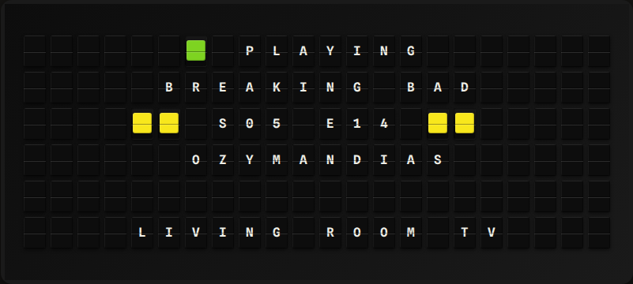

# Plex Now Playing Plugin

Show what's playing on your Plex Media Server — movies, TV episodes and music — laid out to fit any board.



**→ [Setup Guide](./docs/SETUP.md)** - Signing in with Plex (or pasting a token) and configuration

## Overview

The plugin asks your Plex Media Server what is streaming (`/status/sessions`) and exposes the title, show, season and episode, artist, album, who is watching, and how far along they are. It also exposes three display lines laid out for the board being rendered: long titles wrap over two lines and the rest of the layout moves around them, so the same page works on a Note, a Flagship, or a Note Array.

## Template Variables

### Display Lines

The display lines are laid out at render time for the width of the board showing them.

| Variable | Description | Example |
|----------|-------------|---------|
| `{{plex.line_1}}` | Movie title, show, or track | `Breaking Bad` |
| `{{plex.line_2}}` | Title overflow, season/episode, or artist | `S05 E14` |
| `{{plex.line_3}}` | Year, episode title, season/episode, or album | `Ozymandias` |

How the lines are filled:

| Playing | Fits one line | Needs two lines |
|---------|---------------|-----------------|
| Movie | title / *blank* / year | title / title / year |
| Episode | show / season+episode / episode title | show / show / season+episode |
| Track | track / artist / album | track / track / artist |
| Nothing | *blank* / `Nothing playing` / *blank* | |

A third line that doesn't fit the board ends in `...`. With **Plex yellow accents** on, the year or season/episode line is framed by two yellow tiles on each side. The variables below always hold the full, untruncated values.

### Media

| Variable | Description | Example |
|----------|-------------|---------|
| `{{plex.title}}` | Title of the movie, episode, or track | `Ozymandias` |
| `{{plex.year}}` | Release year | `2013` |
| `{{plex.show}}` | TV show name (episodes only) | `Breaking Bad` |
| `{{plex.season_episode}}` | Season and episode (episodes only) | `S05 E14` |
| `{{plex.artist}}` | Artist (music only) | `Daft Punk` |
| `{{plex.album}}` | Album (music only) | `Discovery` |
| `{{plex.media_type}}` | `Movie`, `Episode`, `Track`, or `Clip` | `Episode` |

### Playback

| Variable | Description | Example |
|----------|-------------|---------|
| `{{plex.state}}` | `Playing`, `Paused`, `Buffering`, or `Idle` (color-coded) | `Playing` |
| `{{plex.is_playing}}` | Whether the featured stream is playing | `true` |
| `{{plex.user}}` | Plex user watching or listening | `Alex` |
| `{{plex.player}}` | Device playing the stream | `Living Room TV` |
| `{{plex.progress_percent}}` | Progress through the item (0-100) | `64` |
| `{{plex.minutes_left}}` | Minutes until the item finishes | `18` |
| `{{plex.stream_count}}` | Number of active streams | `2` |

### Sessions

When several streams are active, the featured one (above) is the first that is playing, then buffering, then paused. Every stream is also available as `{{plex.sessions.N.field}}`, with the fields `state`, `media_type`, `title`, `year`, `show`, `season_episode`, `artist`, `album`, `user`, `player`, `progress_percent` and `minutes_left`.

## Example Templates

### Note (and Note Arrays)

Center all three lines:

```
{{plex.line_1}}
{{plex.line_2}}
{{plex.line_3}}
```

### Flagship

```
{{plex.state}}
{{plex.line_1}}
{{plex.line_2}}
{{plex.line_3}}

{{plex.player}}
```

### Progress

```
{{plex.line_1}}
{{plex.progress_percent}}% - {{plex.minutes_left}} MIN LEFT
```

## Configuration

| Setting | Type | Required | Default | Description |
|---------|------|----------|---------|-------------|
| `server_url` | string | No | - | Plex server address, e.g. `http://192.168.1.100:32400`. Empty: found through your Plex account |
| `token` | string | No | - | An X-Plex-Token to use instead of **Sign in with Plex**. When set, it wins |
| `server_name` | string | No | - | Which server to use when your account has several and `server_url` is empty |
| `plex_user` | string | No | - | Only show these Plex users' streams (comma-separated) |
| `plex_player` | string | No | - | Only show streams on these devices (comma-separated), e.g. `Living Room TV` |
| `show_accents` | boolean | No | `true` | Frame the year or season/episode line with yellow tiles |
| `hold_seconds` | integer | No | `60` | After playback stops, keep showing it this long before "Nothing playing" (0-600, 0 turns it off) |
| `refresh_seconds` | integer | No | `30` | How often to ask Plex what's playing (10-600) |
| `enabled` | boolean | No | `false` | Enable the plugin |

`PLEX_URL` and `PLEX_TOKEN` environment variables can be used instead of the UI settings.

### Sign in with Plex

Requires FiestaBoard 9.11.0 or later. Click **Sign in with Plex** in the plugin's settings and approve FiestaBoard on Plex's page; nothing to copy. A pasted token (or `PLEX_TOKEN`) still works and takes priority over the sign-in. If Plex stops accepting the sign-in, the settings ask you to sign in again.

With no `server_url`, the plugin asks plex.tv for the servers on your account (`/api/v2/resources`), prefers one you own, and tries its home-network address first, then its remote address, then Plex's relay. This works with a pasted token too.

## Features

- Movies, TV episodes, and music
- Display lines that adapt to the board's width: Note, Flagship, and any Note Array
- Long titles wrap across two lines; the rest of the layout moves to make room
- Optional Plex yellow accent tiles
- Filter to some Plex users, some devices, or both (e.g. whatever is playing on the TV the board hangs over)
- Every active stream available as `sessions`, plus a stream count
- No blank board between episodes: the last stream stays up through Plex's Up Next countdown
- Playback state color-coded: green playing, yellow paused, orange buffering
- Sign in with Plex, or paste a token
- Finds your server through your Plex account, or talks to the address you give it directly

## Author

FiestaBoard Team

Inspired by [plex-now-playing](https://github.com/Sneakamaila/fiestaboard-plugin--plex-now-playing), a community plugin by Sneakamaila.
